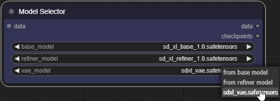
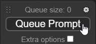

# Searge-SDXL: EVOLVED v4.x for ComfyUI

*(this documentation is work-in-progress and incomplete)*

<!-- TOC -->
* [Searge-SDXL: EVOLVED v4.x for ComfyUI](#searge-sdxl-evolved-v4x-for-comfyui)
  * [Getting Started with the Workflow](#getting-started-with-the-workflow)
  * [Testing the workflow](#testing-the-workflow)
* [Detailed Documentation](#detailed-documentation)
<!-- TOC -->

## Getting Started with the Workflow

After installing the required model files as described in the section *Checkpoints and Models* of the
[main readme file](../README.md#checkpoints-and-models-for-these-workflows)
for this project, follow these steps to test if everything has been installed correctly and is working properly.

**Also make sure you are using the latest `.json` file from the `workflow` folder.**

You can see the version information on the workflow and it should match the latest released version of this project.

## Testing the workflow

To get started, select the base model, refiner model, and VAE in the model selector by clicking on the fields and
selecting the correct files. Using the **refiner is highly recommended** for best results. The recommended VAE is
a fixed version that works in fp16 mode without producing just black images, but if you don't want to use a separate
VAE file just select *from base model*.

 
Once you selected the correct models press the Queue Prompt button in ComfyUI to test if everything is set up
correctly.

# Detailed Documentation

*(TBD)*
