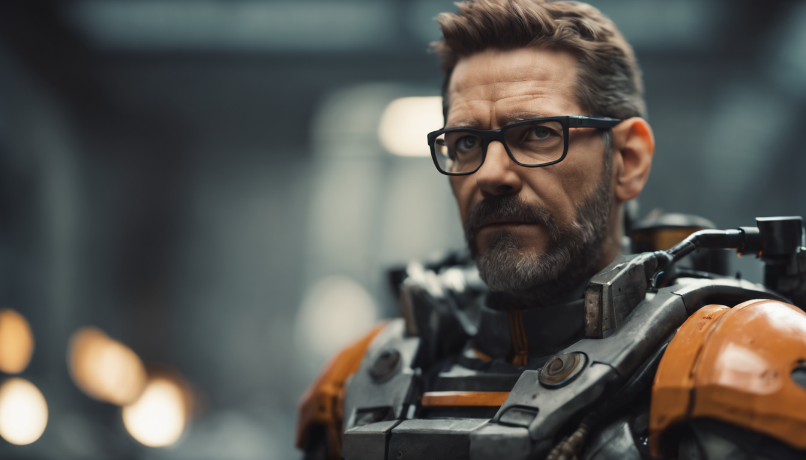
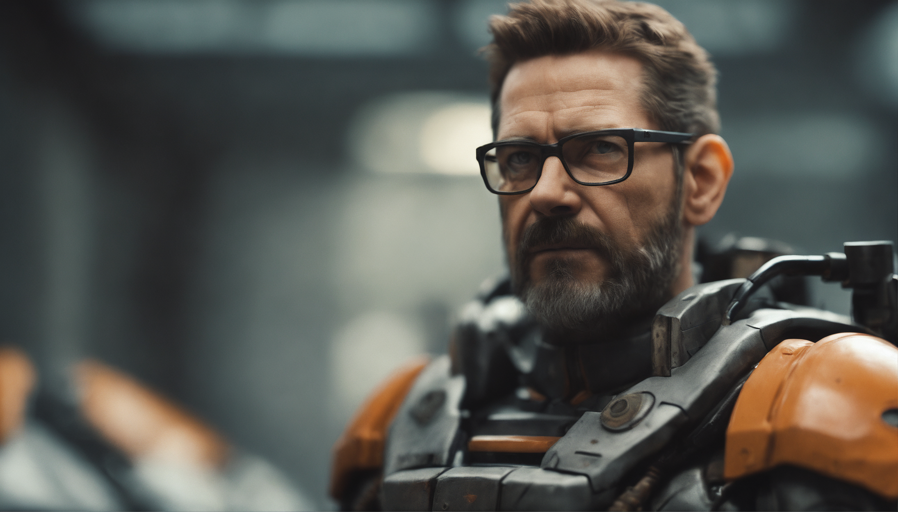
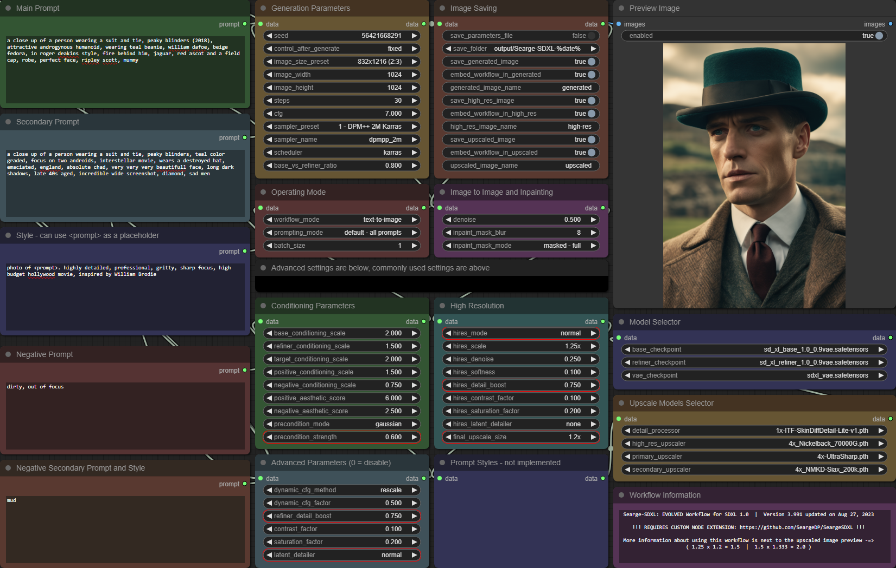
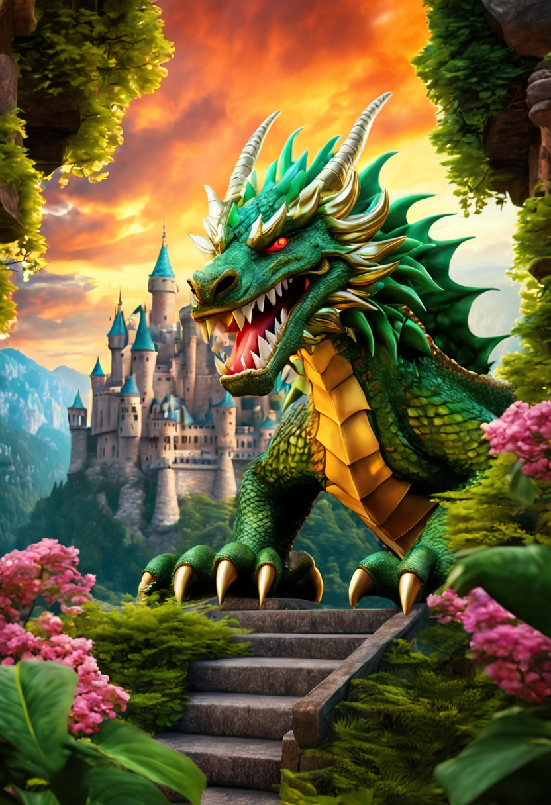
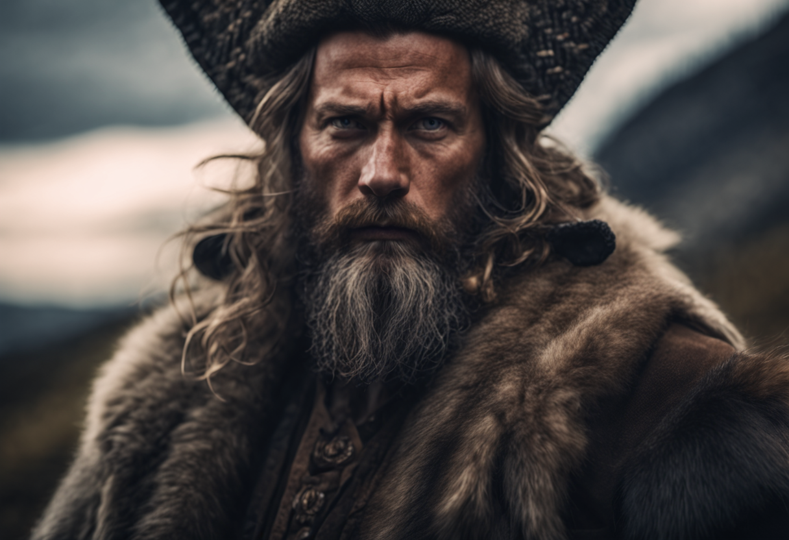

# Example Images

All images in this folder, except `example-2-quality-settings.png`, have the workflow embedded and can be loaded into
ComfyUI to re-create them.

To do that either load the images via the `Load` button or just drag one of the images
on the browser window that has ComfyUI loaded.

## Example 1 - Quick Iteration

This image uses the default settings from the `.json` file and should generate quickly. These settings are a great
starting point to quickly test a prompt or generate batches of images to pick from for further refinement.

## Example 2 - High Quality

This is a variation of example 1, but with some settings changed to produce a higher quality and higher resolution 
result in the end.

Here is an overview of the main settings that can be used to get higher quality results.

## Example 3 - Watching the Universe End

Using a prompt from one of the signature images that were used in an older version's release on CivitAI. 

## Example 4 - Albert Einstein Running a Marathon

This was an idea for some test images generated with an older version of this workflow during development.

# Example 5 - Dragon

Who doesn't like dragons? We had to have one in these examples.

# Example 6 - Revision Ghost

Based on a prompt idea I found on one of the Discord servers. Re-creating a similar effect without the use of a LoRA,
but using one of the 5 included controlnet/revision stages instead.

# Example 7 - Controlnet Sketch Warrior

Using one of the 5 included controlnet/revision stages to create a realistic looking image of a warrior.

